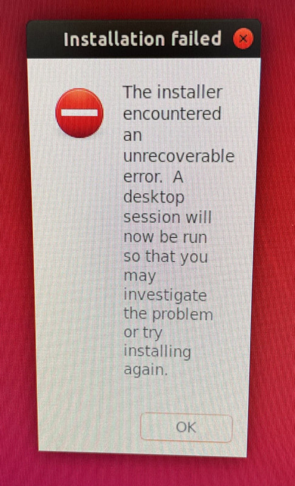
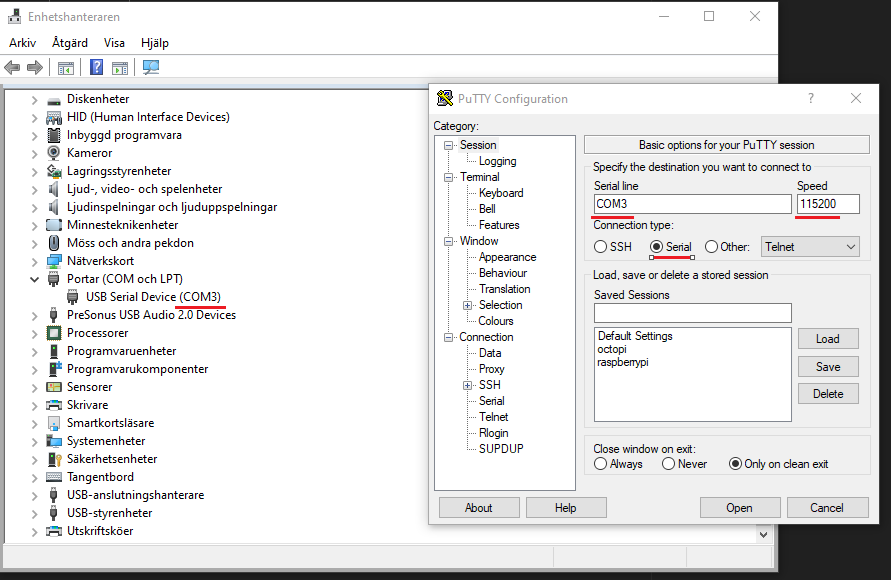
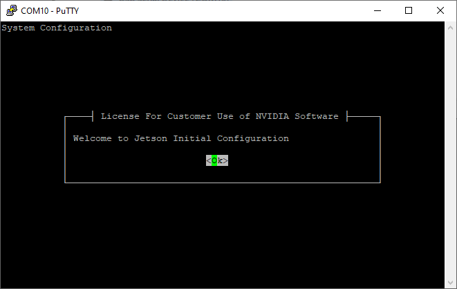

# Installing Jetson Nano from Windows

On some Jetson models, the automatic install script fails with an error. It looks something like this when you start the Jetson.

  

To install it, you need to do a headless install. This instruction is for a Windows machine.

## Prerequisites

Download and install:

- [Putty](https://www.chiark.greenend.org.uk/~sgtatham/putty/latest.html)
- [Balena Etcher](https://etcher.balena.io/)
- [Jetson Nano Image](https://developer.nvidia.com/jetson-nano-sd-card-image)

## Instructions

1. Flash the image to the SD card normally with Balena Etcher.
2. Only connect the USB and power jack to the Jetson. The power jack jumper needs to be attached. Remove all other connected peripherals from the Jetson.
3. Connect with Putty to the Serial COM port that is chosen for Jetson. It can be found in Windows Device Manager. Change the Speed to `115200`. Press `Open`.

  

4. When you are connected, you will see something like this:

  

   Follow the instructions to the Ethernet configuration page.
   
5. Connect the Jetson to a router (company network, for example) with an Ethernet cable. Choose `eth0`. (It's possible that this cable could have been connected in the first place too.)
6. Follow the instructions to the end, and set up the user and password.

After that, it was possible to start up with HDMI and peripherals connected.
